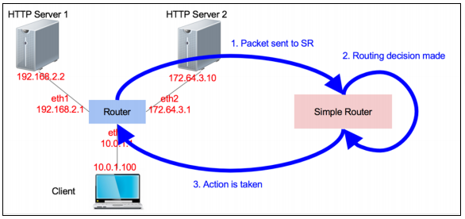
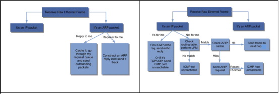

# Static-Router
### CS551-Lab1
Writing a simple router configured under a static routing table and a static networking topology. Router will receive raw Ethernet frames. It will process the packets just like a real router, then forward them to the correct outgoing interface. The task is to implement the forwarding logic so packets go to the correct interface.

Implemented the function `sr_handlepacket(sr, packet, len, interface)`, which is called each time the router receives a packet on the interface and contains the complete logic of how the router should deal with an incoming packet. The high level design can be demonstrated in the flowchart shown below.

Here's a breakdown of what it does:
* Handling ARP Packets:
  * When an ARP packet arrives, the router checks whether it's a request targeted at one of its interfaces. If it is, the router responds with an ARP reply. If it's an ARP reply to a previously sent request, the router processes the reply to determine which waiting packets can now be forwarded.

* Handling IP Packets:
  * For incoming IP packets, first the router will verify the checksum of ip_packet. If it's not correct, it drops the packet. And the router checks if the destination IP address belongs to one of its interfaces. If it does:
    * For ICMP echo requests, the router replies with an ICMP echo reply.
    * For other types of packets (like TCP/UDP, possibly Traceroute), the router replies with an ICMP Port Unreachable message.
  * If the packet is not destined for one of its interfaces:
    * The router checks if the Time-to-Live (TTL) has expired. If it has, the router sends an ICMP Time Exceeded message.
    * If the TTL is still valid, the router would find the next-hop IP address using the longest prefix match, then consult the ARP cache to find the next-hop's MAC address, and finally send out the packet. If the ARP cache doesn't have an entry for the next-hop IP, the router should initiate an ARP request. If there's matched next-hop, it will instead send back an ICMP Net Unreachable message.

## How to Run
You can simply run by

    sudo ./run_all.sh
    ./sr

You can log the packets received and generated by your SR program by using the -l parameter. The file will be in pcap
format, so you can use tcpdump to read it.

    ./sr -l logfile.pcap

Besides SR, you can also use Mininet to monitor the traffic that goes in and out of the emulated nodes, i.e., router,
server1 and server2.

    mininet> server1 sudo tcpdump -n -i server1-eth0